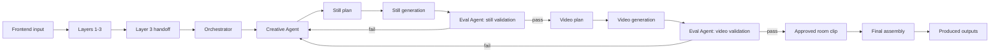

# Haus Agent System

## Index
- [Orchestrator Agent](/docs/orchestrator_agent.md)
- [Creative Agent](/docs/creative_agent.md)
- [Eval Agent](/docs/eval_agent.md)
- [Agent Runtime State Machine](/docs/agent_runtime_state_machine.md)
- [Layer 3 Handoff Data Model](/docs/layer_3_handoff_data_model.md)

## Goal
Haus turns:
- a floor plan
- a Pinterest board
- a brief
- selected objects

into:
- validated room stills
- validated room video clips
- a final edited home video package

The system is room-first.
It does not create one generic whole-house clip.
It creates one approved room clip at a time, then assembles them into the final output.

## Workflow

## Frontend To Backend Contract
The frontend should submit:
- floor plan selection or upload
- Pinterest board URL
- optional brief
- selected objects
- platform target

The frontend should not:
- build prompts
- call fal directly
- decide retries
- decide approval

The frontend should:
- create a job
- subscribe to job events
- show per-room status
- show still review UI
- show room clip review UI
- show final outputs

## Backend Runtime
The backend uses:
- Layers 1-3 for input normalization, Pinterest intelligence, and room-level creative handoff
- the 3-agent runtime for generation and evaluation
- the execution layer for OpenAI image generation, fal video generation, and packaging

## Pinterest Context
Pinterest is the style source.
It drives:
- palette
- mood
- materials
- lighting character
- styling rules
- room guidance
- room-level must include and must avoid

This is injected into the Creative Agent through the Layer 3 handoff.

## AutoHDR/fal Workflow Role
The AutoHDR/fal workflow is the production method.
It tells the Creative Agent:
- when to refine a still before video
- how to phrase camera motion
- how to preserve architecture
- how to write negative prompts
- how to retry after still or video failures

So:
- Pinterest tells the system what the room should feel like
- AutoHDR/fal tells the system how to produce it reliably

## Three-Agent Model
### 1. Orchestrator
- owns the state machine
- owns room sequencing
- calls tools
- persists job state
- emits progress

### 2. Creative Agent
- builds executable still and video plans
- patches plans after failure
- combines Pinterest context with AutoHDR/fal prompt rules

### 3. Eval Agent
- validates stills before video
- validates videos before approval
- decides whether to pass, retry, regenerate, or escalate

## Room-Level Execution
For each room:
1. build still plan
2. generate still
3. validate still
4. if still fails, revise still plan and retry
5. if still passes, build video plan
6. generate room clip
7. validate room clip
8. if video fails, retry video or regenerate still
9. approve room clip

Only approved room clips enter final assembly.

## Human Validation
Human review should exist in the loop.

### Humans validate stills when:
- room identity is ambiguous
- style is close but not exact
- staging is technically valid but emotionally weak
- retry budget is exhausted

### Humans validate room clips when:
- motion is acceptable but borderline
- the clip is technically clean but not compelling
- the room clip could pass, but confidence is low

### Human review UI should show:
- current still
- prior still attempts
- current room clip
- prior room clip attempts
- failure reasons
- approve or reject controls
- request-retry controls

## What Makes The Final Output Engaging
The final product should not be a plain stitched slideshow.

It should feel:
- premium
- calm
- cinematic
- spatially coherent
- emotionally desirable

The final output should use:
- room clips with varied but compatible motion
- strong open and close shots
- clean pacing
- stable exposure
- subtle transitions
- platform-aware aspect ratios

## Produced Outputs
At minimum:
- approved room stills
- approved room video clips
- final assembled video
- export variants by aspect ratio
- job log
- validation summaries

Optional:
- mood board
- caption set
- Miro presentation board

## Tooling
### OpenAI
- floor plan parsing
- Pinterest aesthetic extraction
- room-level creative planning
- still generation, if selected
- evaluation, if selected

### fal via `genmedia`
- image edit and refinement
- image-to-video
- text-to-video fallback
- model schema inspection
- uploads and downloads

### FFmpeg
- clip stitching
- resizing
- packaging

## `genmedia` Role
`genmedia` is not the agent.
It is the fal execution layer.

It should be wrapped by a backend adapter that exposes:
- upload
- run
- status
- download
- pricing
- schema

## Output Quality Standard
A room should only be approved when it is:
- the correct room
- visually premium
- architecturally stable
- stylistically consistent with Pinterest intent
- smooth in motion
- credible as real-estate media

## Final Principle
Haus should behave like a structured creative runtime, not a loose prompt playground.

The system should be:
- room-based
- stateful
- validated
- retry-aware
- human-reviewable
- optimized for polished, sellable property video
