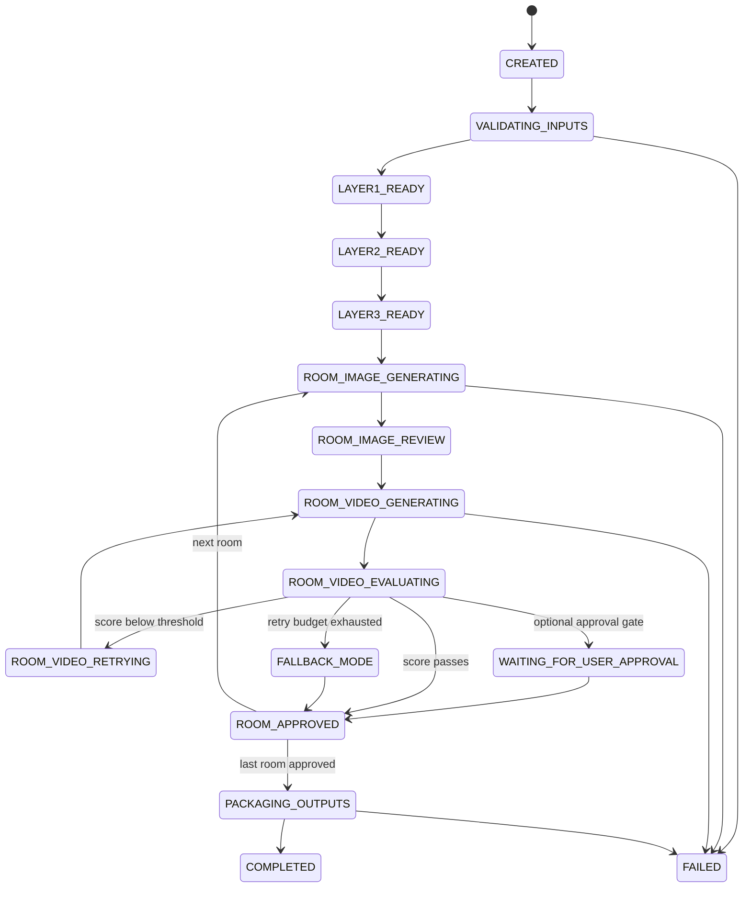
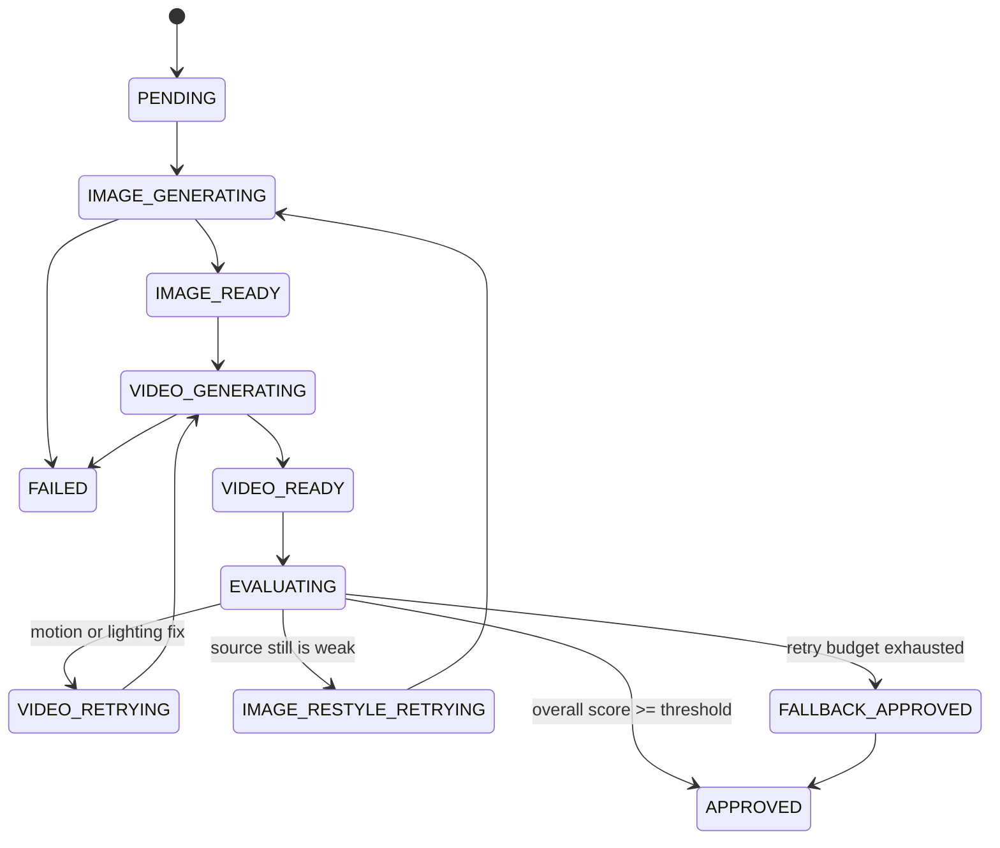

# Haus Agent Runtime

This document defines the backend agent handoff contracts and the final job state machine for Layers `3.5-5`.

## JSON handoffs

Use these schemas:

- [schemas/agent_runtime_handoff.schema.json](/Users/tarive/haus/haus/schemas/agent_runtime_handoff.schema.json)
- [schemas/agent_job_runtime.schema.json](/Users/tarive/haus/haus/schemas/agent_job_runtime.schema.json)

### Purpose split

- `agent_runtime_handoff.schema.json`
  The message passed between `orchestrator`, `creative_agent`, and `eval_agent`.
- `agent_job_runtime.schema.json`
  The persisted runtime state for the whole job and each room.

## Agents

### `orchestrator`

Owns:

- job state transitions
- room sequencing
- retry budget
- fallback mode
- artifact persistence

### `creative_agent`

Owns:

- image refinement decision
- motion prompt construction
- negative prompt updates
- retry prompt adjustments

Uses:

- Layer 3 handoff
- `autohdr-fal` skill
- prior eval failures

### `eval_agent`

Owns:

- image/video scoring
- failure classification
- pass/fail decision support

Uses:

- generated artifacts
- target aesthetic profile
- room spec
- `autohdr-fal` invariants

## Job state machine

## Room state machine with retry transitions

## Retry policy

Preferred order:

1. Retry prompt only.
2. If the still image is weak, restyle the image and try video again.
3. If motion is too ambitious, downgrade to a safer motion mode.
4. If all attempts fail, approve fallback output or mark room failed.

## Suggested failure classes

- `architecture_warp`
- `layout_drift`
- `lighting_unrealistic`
- `motion_unstable`
- `style_mismatch`
- `muddy_exposure`
- `object_missing`

## How `autohdr-fal` is used

The skill is a policy/input for the `creative_agent` and `eval_agent`.

It provides:

- image-first vs video-first decision rules
- motion prompt templates
- negative prompt defaults
- invariants:
  - preserve architecture
  - preserve layout
  - use plausible light sources
  - keep camera motion stable

The orchestrator should never parse prompts directly. It asks the `creative_agent` for a handoff, then executes tools from that handoff.

## Tool access

### `orchestrator`

- file store
- cache
- `genmedia` adapter
- OpenAI adapter
- Apify adapter
- FFmpeg adapter
- Miro adapter

### `creative_agent`

- Layer 3 handoff
- `autohdr-fal` skill
- prior prompts
- prior eval summaries

### `eval_agent`

- room artifacts
- target aesthetic summary
- prompt used
- prior attempt scores

## Example handoff sequence

1. `orchestrator -> creative_agent`
   `purpose=plan_video_prompt`
2. `creative_agent -> orchestrator`
   returns prompt strategy
3. `orchestrator -> genmedia`
   executes image-to-video
4. `orchestrator -> eval_agent`
   `purpose=evaluate_room_video`
5. `eval_agent -> orchestrator`
   returns scores and failure modes
6. If failed:
   `orchestrator -> creative_agent`
   `purpose=refine_after_failure`
7. Retry until pass or fallback.
